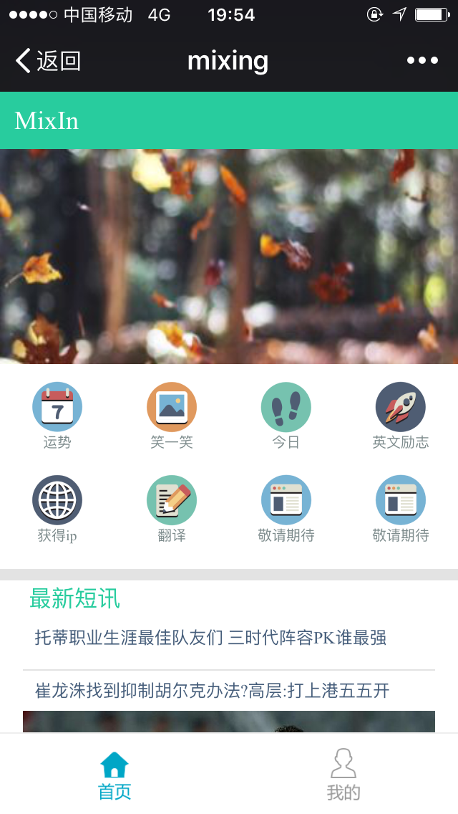
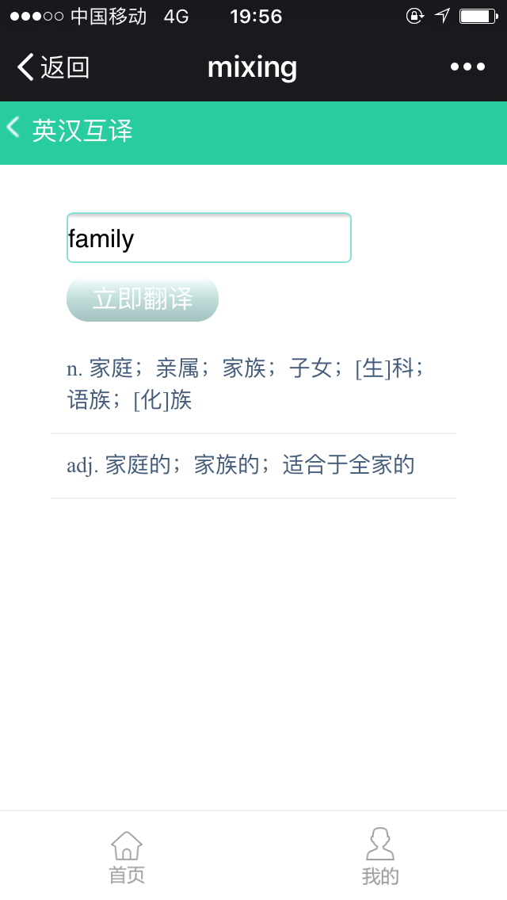
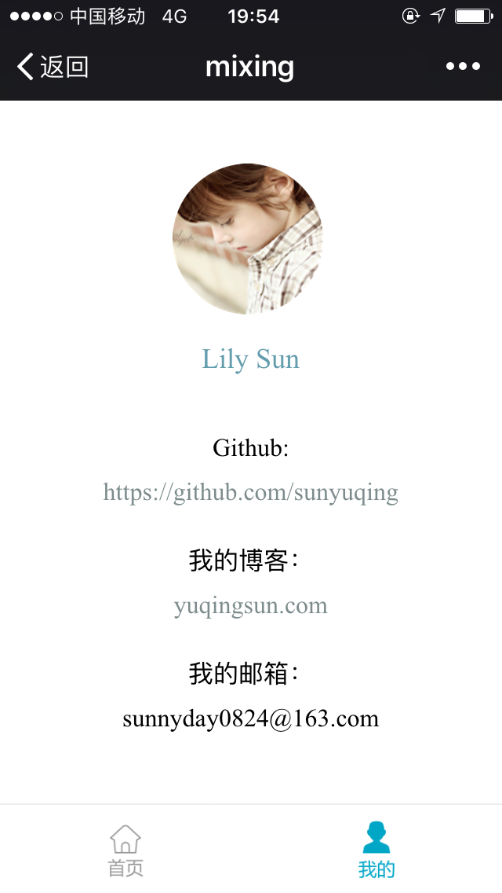

# MixIn 基于vue的web app

> a mixing SPA project using vue vuex vue-router webpack and so on

## 技术栈
        
        vue + axios + vue-router + webpack 

## 项目截图

    
    
    
        
        

## 在线demo

    [demo演示](sunyuqing.coding.me/mixIn)        

## Build Setup

``` bash
# install dependencies
npm install

# serve with hot reload at localhost:8080
npm run dev

# build for production with minification
npm run build

# build for production and view the bundle analyzer report
npm run build --report
```
